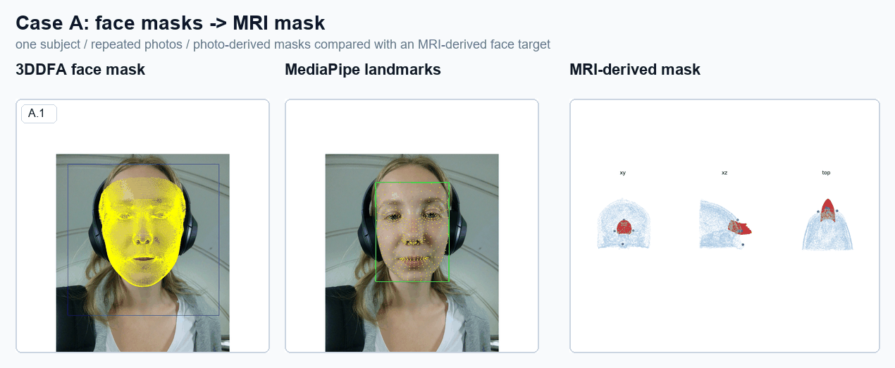
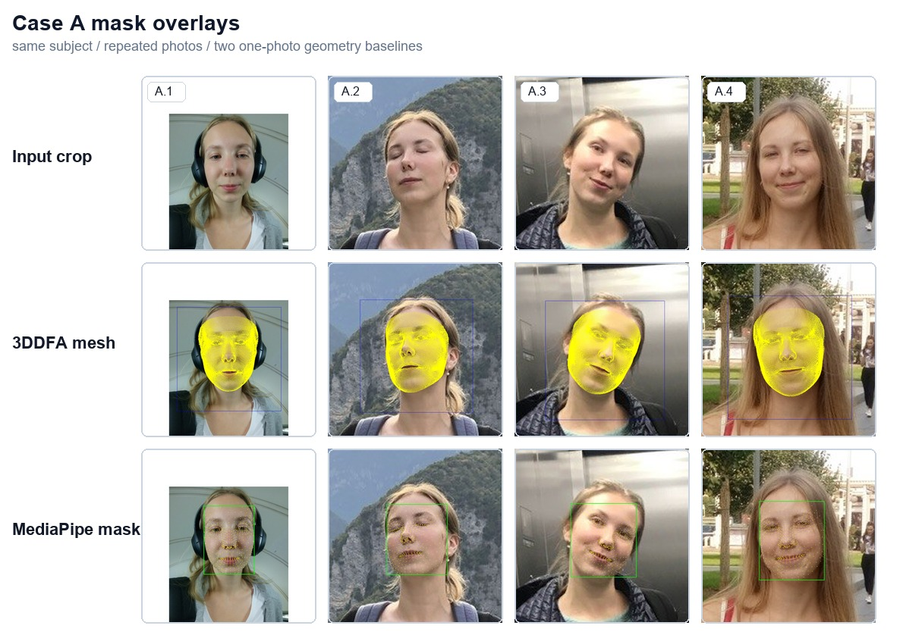
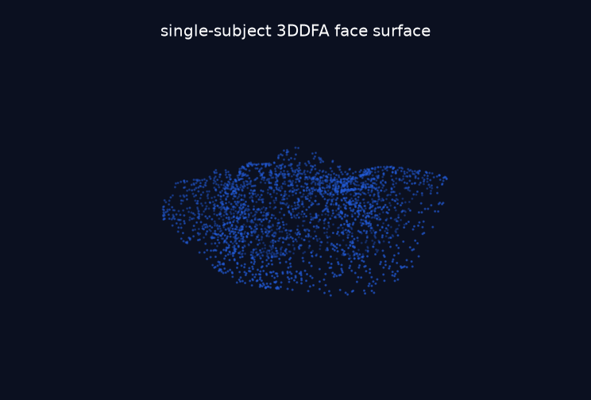
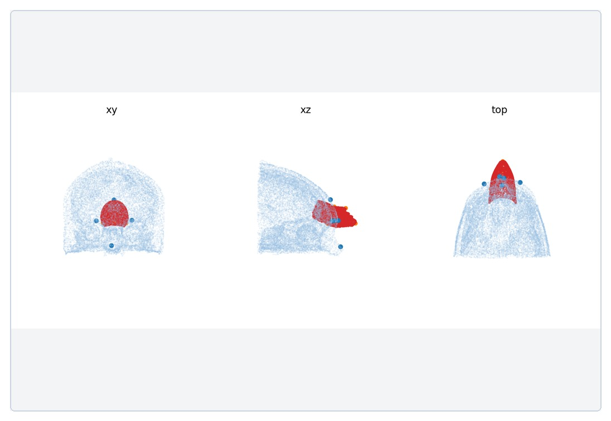
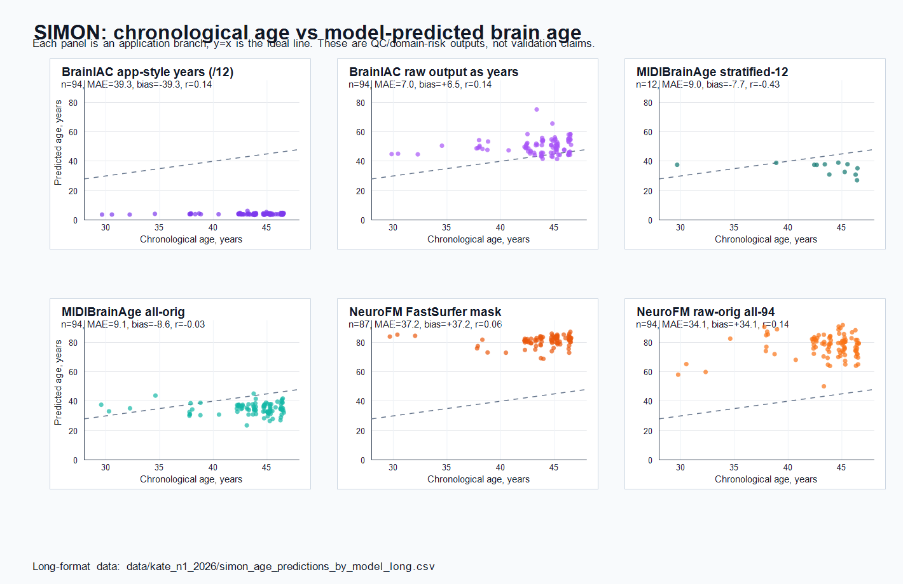
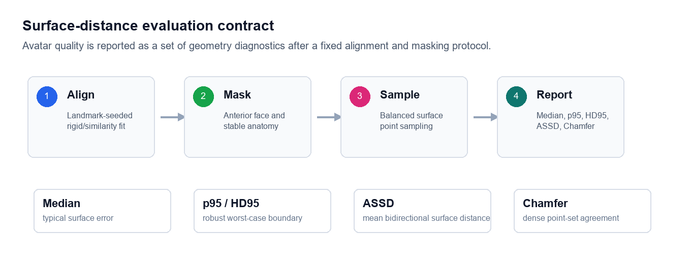
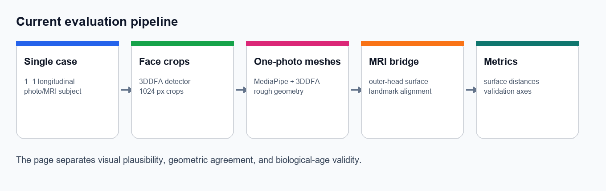

<div align="center">

# FaceAge to BrainAge

**Same-scan facial and brain aging signals from structural MRI**

Longitudinal robustness, avatar-to-MRI quality control, and evidence-aware
evaluation

[Project page](https://kondratevakate.github.io/faceage-to-brainage/) |
[Manuscript](papers/manuscript/manuscript.tex) |
[Methods and reports](docs/kate_n1_2026/) |
[Branch model](docs/REPOSITORY_BRANCHES.md)

`#BrainAge` `#FaceAge` `#MRI` `#Neuroimaging` `#LongitudinalImaging`
`#DigitalBiomarkers` `#3DFaceReconstruction` `#ReproducibleResearch`

</div>

<p align="center">
  
</p>

<p align="center"><em>
Current Case A bridge from repeated photographs to an MRI-derived target. This
is a QC visualization, not a validated avatar-to-MRI accuracy result.
</em></p>

## Research question

A non-defaced T1-weighted MRI contains two potentially age-sensitive signals:
brain parenchyma and external facial anatomy. This project asks whether age
estimates derived from those signals agree, whether they follow aging within
one person, and how much their outputs change across scanners and
preprocessing choices.

The repository has two connected workstreams:

| Workstream | Input | Current use | Evidence status |
| --- | --- | --- | --- |
| **FaceAge** | MRI-derived face renders and repeated photographs | Face-age estimation, one-photo meshes, MRI face-target QC | Method development; current longitudinal face-age models fail on SIMON |
| **BrainAge** | Structural T1 MRI with model-specific preprocessing | Age prediction, test-retest analysis, scanner and perturbation robustness | Application/robustness branch; not population validation |

The shared objective is not to produce one authoritative "biological age."
It is to separate absolute calibration, longitudinal sensitivity,
test-retest repeatability, scanner dependence, and uncertainty.

## Current renders

### Repeated-photo face baseline

<p align="center">
  
</p>

Four photographs of one subject are processed by the same 3DDFA and MediaPipe
baselines. They establish crop, landmark, and rough surface consistency under
pose and acquisition changes. They do not establish identity-grade or
anatomically accurate avatar reconstruction.

<table>
  <tr>
    <td width="50%" align="center">
      
    </td>
    <td width="50%" align="center">
      
    </td>
  </tr>
  <tr>
    <td align="center"><em>One-photo 3DDFA surface</em></td>
    <td align="center"><em>Landmark-seeded MRI alignment diagnostic</em></td>
  </tr>
</table>

The alignment is useful for detecting coordinate, scale, and masking failures.
The current automatic MRI facial surface does not pass the QC gate required
for anatomical distance claims.

### SIMON longitudinal brain-age benchmark

<p align="center">
  
</p>

The expanded benchmark compares application-style outputs from BrainIAC,
MIDIBrainAge, and NeuroFM preprocessing branches on the longitudinal SIMON
single-subject dataset. Some outputs increase with chronological age, but all
shown branches remain substantially biased or incompletely calibrated.
Cross-model MAE is not a fair ranking when output semantics, preprocessing,
and included scans differ.

Long-format values and branch-specific sample counts are available in
[`data/kate_n1_2026/simon_age_predictions_by_model_long.csv`](data/kate_n1_2026/simon_age_predictions_by_model_long.csv).

### Evaluation contract

<p align="center">
  
</p>

Avatar geometry is evaluated only after a fixed alignment, anatomical mask,
balanced surface sampling, and predefined metrics. Visual plausibility,
geometric agreement, identity consistency, and biological-age validity are
separate claims.

## What the article contributes

The article makes a methodological contribution rather than a clinical claim:

1. It defines a **same-scan paired design** that extracts facial and brain-age
   signals from one non-defaced T1 volume, removing the timing mismatch of
   separately acquired MRI and photographs.
2. It uses the longitudinal, multi-scanner **SIMON n=1 stress test** to
   distinguish scanner repeatability, absolute calibration, and within-person
   temporal sensitivity.
3. It demonstrates that **repeatability is not validity**: a model can have
   low variance across scanners while remaining strongly biased, and a
   detectable age slope can coexist with poor absolute accuracy.

The result is hypothesis-generating. A single subject cannot establish
population accuracy, clinical utility, disease risk, or a validated biological
age biomarker.

## Evidence status

| Question | Current observation | Supported interpretation |
| --- | --- | --- |
| Are repeated photos processable? | Four Case A photos produce usable crops, landmarks, and rough meshes | Pipeline/QC feasibility for this subject |
| Is the current avatar anatomically accurate? | MRI facial target remains segmentation-limited | **Blocked**; no anatomical accuracy claim |
| Do tested brain-age outputs follow SIMON's age? | Direction and slope vary by model/preprocessing; biases remain large | Robustness and domain-shift evidence only |
| Does NeuroFM validate segmentation or morphometry? | Pretrained predictions/features can be extracted | **No**; it is a separate foundation-model application branch |
| Is this a clinical biological-age estimate? | No population calibration or outcome validation is present | **No clinical or diagnostic interpretation** |

## Pipeline

<p align="center">
  
</p>

The core manuscript experiment and the newer application branches use related but not
identical model stacks. Every reported result therefore names its model,
preprocessing, output interpretation, and included scans.

## Reproduction entry points

```bash
conda env create -f environment.yml
conda activate faceage
pytest -q
```

- Core face/brain modules: [`src/`](src/)
- Batch and analysis scripts: [`scripts/`](scripts/)
- Avatar QC utilities: [`scripts/photo_mri_avatar/`](scripts/photo_mri_avatar/)
- NeuroFM application scripts: [`experiments/kate_n1_2026/`](experiments/kate_n1_2026/)
- Model and preprocessing status: [`data/kate_n1_2026/method_status_matrix.csv`](data/kate_n1_2026/method_status_matrix.csv)
- Scientific reports: [`docs/kate_n1_2026/`](docs/kate_n1_2026/)
- Public article source: [`project_page/`](project_page/)

Raw MRI, model weights, caches, logs, private face artifacts, and large NIfTI
outputs are intentionally excluded from Git. See
[`vendor/MODELS.md`](vendor/MODELS.md) for external model requirements.

## Authors and article

**Ekaterina Kondrateva**, **Ramil Khafizov**, and **Gleb Bobrovskikh**

Current manuscript:
*MRI-derived Face Age vs Brain Age from the Same T1 Scan: a Longitudinal
Single-Subject Stress Test*.

The manuscript is under development. Cite a specific Git commit when referring
to repository results because model coverage and preprocessing branches are
still evolving.
