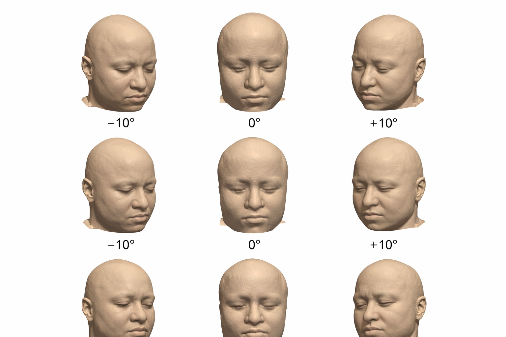

# faceage-to-brainage

**Does the face in your MRI scan know how old your brain is?**

A proof-of-concept project for linking facial aging signals, brain-age estimation, and MRI-grounded human-avatar evaluation.

<p align="center">
  
</p>
<p align="center"><em>Nine-view frontal renders extracted from a single T1 MRI via marching cubes. These are the inputs to the face branch.</em></p>

## Current Focus: One-Photo Avatar Evaluation

The active project page is:

**[FaceAge-to-BrainAge: MRI-grounded evaluation of one-photo human avatars](https://kondratevakate.github.io/faceage-to-brainage/)**

This page is the clearest current artifact of the project. It frames a single-subject photo/MRI case study and asks whether one-photo facial avatars can be evaluated against an MRI-derived face surface rather than judged only by visual plausibility.

### Current Case Evidence

<p align="center">
  
</p>
<p align="center"><em>Primary case subject: repeated face photographs with current photo-avatar preprocessing baselines. The avatar side is usable for QC; the MRI face target is currently rejected until segmentation is improved.</em></p>

<p align="center">
  
</p>
<p align="center"><em>Primary case subject: repeated face photographs with photo-derived face masks and an MRI-derived face target. These are qualitative alignment diagnostics, not identity-grade avatar results.</em></p>

<p align="center">
  
</p>
<p align="center"><em>MRI bridge: current landmark-constrained alignment preview between photo-derived face geometry and the MRI-derived outer-head surface.</em></p>

Current contribution:

- define a case-only visual project page with no public display of control subjects;
- separate four claims that are often blurred together: geometry, perception, identity, and biological age;
- establish a surface-distance evaluation contract for avatar-to-MRI comparison: alignment, masking, sampling, and reporting;
- keep FaceAge/twin-study evidence as biological-age narrative context, not as proof that a one-photo avatar is biologically valid.

Primary entry points:

- Project page: [https://kondratevakate.github.io/faceage-to-brainage/](https://kondratevakate.github.io/faceage-to-brainage/)
- Local project-page source: [project_page/index.html](project_page/index.html)
- Avatar page status: [project_page/STATUS.md](project_page/STATUS.md)
- MRI face target plan: [project_page/MRI_FACE_TARGET_PLAN.md](project_page/MRI_FACE_TARGET_PLAN.md)
- Metrics and label definitions: [project_page/METRICS_AND_LABELS.md](project_page/METRICS_AND_LABELS.md)
- Twin/FaceAge literature context: [project_page/TWIN_FACEAGE_LITERATURE_CONTEXT.md](project_page/TWIN_FACEAGE_LITERATURE_CONTEXT.md)
- Project-page generator: [project_page/build_project_page.py](project_page/build_project_page.py)

Older/adjacent material:

- MRI face/brain-age article draft: [papers/midl2026/midl-shortpaper.tex](papers/midl2026/midl-shortpaper.tex)
- MRI pipeline diagram: [pipeline.drawio](papers/midl2026/pipeline.drawio)
- General literature review: [papers/related_works/literature_review.md](papers/related_works/literature_review.md)
- Datasets catalog: [DATASETS.md](DATASETS.md)

## Repository Policy

The repository separates reusable methods from experiment-specific evidence:

- `scripts/` contains reusable pipeline code.
- `papers/` contains manuscript and literature context.
- `project_page/` contains the current claim-facing avatar article: public page,
  curated visual assets, status notes, and metric definitions.
- `notebooks/` is ignored by git. Notebooks are useful for exploration, but
  they are not treated as the scientific record unless explicitly curated.

Raw data, face crops, meshes, per-photo overlays, MRI surfaces, CSV manifests,
and internal control-subject outputs are intentionally local/ignored. This keeps
the public repository focused on claims, methods, and curated evidence rather
than intermediate working state.

---

## Global Landscape: Age Estimation from Face and Brain

### Face age estimation

The face is one of the most information-dense age signals available non-invasively. Under controlled conditions, deep models trained on large face-photo datasets achieve around **3 years MAE** for chronological age (Zhang et al. 2023; Rothe/DEX ~3.2 yr on MORPH-II). Among the components that carry most of the age signal:

- **Skin tone, texture, and facial contrast** - account for roughly 25-33% of age-perception accuracy; their removal from older faces collapses judgments toward chance
- **Periocular region and sclera** - scleral color (darker, redder, yellower) and orbital changes concentrate multiple aging processes in a small area; highly sensitive to rendering artifacts
- **Facial fat compartments** - MRI evidence shows significant age-related change in cheek fat distribution; muscle volume does not differ significantly across age groups in healthy women

The most important practical distinction: **apparent/perceived age**, **chronological age**, and **biological age** are different targets. FaceAge (Bontempi et al., *Lancet Digital Health* 2025) is a biological-age model - cancer patients look 4.79 years older on average, and the face-age gap predicts survival. It is not a fair chronological-age benchmark. For a direct chronological-age comparison, MiVOLO (face-only checkpoints, MAE ~4.3 yr) is the appropriate open baseline.

### Brain age estimation

Whole-brain structural T1-weighted MRI is one of the strongest non-invasive age signals available. Across large adult lifespan cohorts, realistic expectation is **4-6 years MAE** for healthy adults:

- SFCN (Peng et al. 2021): **2.14 yr MAE** on UK Biobank in-distribution; but 9-10 yr on independent CamCAN (scanner shift). In-distribution performance should not be taken as a universal ceiling.
- SynthBA: best open protocol-agnostic option; handles T1, T2, and FLAIR without retraining
- BrainIAC (Tak et al. 2026, *Nature Neuroscience*): foundation model (ViT-B, SSL on ~49k MRIs); brain-age MAE 6.55 yr at 20% fine-tuning; demonstrates few-shot generalization across 7 simultaneous tasks
- Kim et al. 2025: **2.73 yr MAE** on clinical 2D T1 after bias correction - strongest clinical result, but not openly runnable

Brain vascular markers (WMH, microangiopathic change) are auxiliary biomarkers of aging heterogeneity, not mature standalone age clocks. Healthy aging diverges substantially after ~70 years, particularly in hippocampus, amygdala, and temporal cortex.

### The link - and the gap

| Evidence | Direction | Source |
|----------|-----------|--------|
| Twin who looked older died first in 73% of pairs | Face -> mortality | Christensen et al., *BMJ* 2009 |
| Looking 5 yr younger -> lower COPD, osteoporosis, cognitive decline risk | Face -> health | Rotterdam Study, *BJD* 2023 |
| Brain-PAD at midlife predicts older facial appearance | Brain -> Face | Belsky et al., *Mol Psychiatry* 2019 |
| Multimodal brain-PAD not significantly associated with facial aging | Null | Cole et al., *NeuroImage* 2020 |

The Cole 2020 null result used **subjective facial age ratings** - imprecise and not scalable. This project replaces that with AI-derived face age from **MRI morphology**: bone structure, subcutaneous fat volume, orbital recession. These are fundamentally different measurements. Our pipeline tests whether the morphological face-age signal from T1 MRI correlates with brain parenchymal aging in the same scan.

**Core tension**: the most age-informative facial cues (skin appearance, scleral color, eye-region detail, fat redistribution) are least grounded in structural MRI and most vulnerable to hallucination by generative models. This makes validation against brain age from the same scan essential.

---

## Research Question

Standard brain-age models predict age from brain parenchyma: grey and white matter volumes, cortical thickness, and related structural signals. But every non-defaced T1 MRI also contains the full 3D morphology of the face: subcutaneous fat distribution, orbital recession, facial bone structure, and soft-tissue shape.

This project asks: if you extract two age estimates from the same T1 scan - one from the brain and one from the face - do they agree? Do they capture the same underlying aging process, or partially independent biological signals?

Why this is interesting:
- prior work typically paired MRI with photographs taken separately
- this repo extracts both signals from a single file
- the face signal is morphological and MRI-derived, not a standard photo-age setting

---

## Pipeline

```text
T1 MRI (.nii.gz)
    |
    |-- FACE BRANCH
    |   marching cubes (t=30) -> PyVista 9-view render
    |   -> FaceAge (ResNet-50) -> average -> linear calibration
    |   -> face_age, face_age_gap
    |
    `-- BRAIN BRANCH
        SynthStrip (skull strip) -> SynthBA
        -> brain_age, brain_age_gap

Per subject: chron_age, face_age, brain_age, face_age_gap, brain_age_gap
Gap analysis: scripts/gap_correlation.py -> papers/tables/gap_correlation.csv
```

See [papers/midl2026/pipeline.drawio](papers/midl2026/pipeline.drawio) for the full diagram (open in VS Code Draw.io extension or app.diagrams.net).

---

## Datasets

### IXI
Cross-sectional healthy brain MRI from three London sites.
- ~580 subjects, ages 20-86, sites: Guys, HH, IOP
- T1, T2, PD modalities; non-defaced
- Used: 406 subjects (face age), 105 (brain age), 93 (gap correlation)
- Download: <https://brain-development.org/ixi-dataset/>

### SIMON
Single-subject MRI reliability dataset.
- 1 healthy male, 73 sessions, 36 scanners, ages 29-46
- 99 T1 scans; non-defaced
- Used for scanner reproducibility (H3)

See [papers/data/README.md](papers/data/README.md) for full download instructions.

---

## Repository Structure

```text
faceage-to-brainage/
|-- project_page/           <- curated avatar article: page, visuals, status, metrics
|-- scripts/
|   |-- photo_mri_avatar/  <- reusable photo/MRI avatar utilities
|   |-- gap_correlation.py
|   |-- batch_render.py
|   |-- batch_face_age.py
|   |-- batch_brain_age.py
|   `-- batch_sfcn.py
|-- src/
|   |-- brain_age.py
|   |-- face_age.py
|   |-- render.py
|   |-- utils.py
|   |-- faceage/
|   `-- face_age_morphometrics/
|-- papers/
|   |-- midl2026/          <- article draft source + pipeline.drawio
|   |-- data/              <- dataset download instructions
|   |-- tables/            <- generated CSV results, gitignored except markers
|   |-- figures/           <- generated figures, gitignored except curated assets
|   |-- notes/             <- implementation notes
|   `-- related_works/     <- literature review
|-- config/
|-- tests/
|-- vendor/                <- external models/code; weights ignored
|-- DATASETS.md
|-- environment.yml
`-- requirements.txt
```

`project_page/` is the public article source for the active avatar workstream.
The local reconstruction workbench lives in ignored data folders, not in the
public article tree. Intermediate crops, meshes, CSV dumps, MRI surfaces,
notebooks, and internal control-subject artifacts stay local/ignored unless
they are deliberately curated for release.

---

## Setup

### Option A: conda
```bash
conda env create -f environment.yml
conda activate faceage
```

### Option B: pip
```bash
pip install -r requirements.txt
```

### Model weights

See [vendor/MODELS.md](vendor/MODELS.md) for pinned versions and download links.

```bash
# FaceAge
git clone https://github.com/AIM-Harvard/FaceAge vendor/FaceAge
# Download FaceAge_weights.pt and age_regressor.pt -> vendor/FaceAge/models/

# SynthBA - installed via pip (see requirements.txt)
# No manual weight download needed

# SFCN (optional)
git clone https://github.com/ha-ha-ha-han/UKBiobank_deep_pretrain vendor/SFCN
# Download run_20190719_00_epoch_best_mae.p -> vendor/SFCN/brain_age/
```

### Runtime config
Copy the example config and fill in local paths:
```bash
cp config/brain_age_runtime.example.json config/local/brain_age_runtime.json
```

---

## Quickstart

### Reproduce main results (local)

```bash
# 1. Proof of concept - single scan
jupyter notebook notebooks/01_poc_single_scan.ipynb

# 2. Batch render face images from IXI T1 scans
python scripts/batch_render.py papers/data/ixi/T1/ papers/figures/ixi_renders/ --workers 4

# 3. Run FaceAge on rendered PNGs
python scripts/batch_face_age.py papers/figures/ixi_renders/ papers/tables/face_ages.csv \
    --faceage vendor/FaceAge --bypass-mtcnn

# 4. Run SynthBA brain-age
python scripts/batch_brain_age.py papers/data/ixi/T1/ papers/tables/brain_ages.csv

# 5. Compute gap correlation
python scripts/gap_correlation.py
# -> saves papers/tables/gap_correlation.csv
```

### Colab notebooks

| Notebook | Description | Colab |
|----------|-------------|-------|
| [07_synthba_colab.ipynb](notebooks/07_synthba_colab.ipynb) | SynthBA on IXI (main brain-age result) | [](https://colab.research.google.com/github/kondratevakate/faceage-to-brainage/blob/main/notebooks/07_synthba_colab.ipynb) |
| [08_synthba_simon_colab.ipynb](notebooks/08_synthba_simon_colab.ipynb) | SynthBA on SIMON (reproducibility) | [](https://colab.research.google.com/github/kondratevakate/faceage-to-brainage/blob/main/notebooks/08_synthba_simon_colab.ipynb) |
| [05_sfcn_colab_bootstrap.ipynb](notebooks/05_sfcn_colab_bootstrap.ipynb) | SFCN baseline on SIMON | [](https://colab.research.google.com/github/kondratevakate/faceage-to-brainage/blob/main/notebooks/05_sfcn_colab_bootstrap.ipynb) |

---

## Key External Tools

| Tool | Reference | Use |
|------|-----------|-----|
| FaceAge | Bontempi et al., *Lancet Digital Health* 2025 | Face age from MRI renders |
| SynthBA | Lemaître et al. 2022 | Primary brain-age model |
| SynthStrip | Hoopes et al. 2022 | Skull stripping |
| SFCN | Peng et al., *Med Image Anal* 2021 | Brain-age baseline |
| MIDIBrainAge | MIDI Consortium | Sequence-specific brain age (in progress) |
| BrainIAC | Tak et al. 2026 | Foundation brain-age model (in progress) |
| PyVista | Sullivan & Kaszynski, *JOSS* 2019 | 3D MRI surface rendering |

---

## Brain-Age Model Status

| Model | IXI | SIMON | Notes |
|-------|-----|-------|-------|
| SynthBA | MAE 6.33 yr | SD 1.21 yr | Primary result |
| SFCN | In progress | In progress | Age-bin decoding under validation |
| MIDIBrainAge | In progress | In progress | Notebook 09 in progress |
| BrainIAC | In progress | In progress | Notebook 10 in progress |

---

## Contact

**Ekaterina Kondrateva** - kondratevakate@gmail.com  
**Ramil Khafizov**, **Gleb Bobrovskikh**

Code: <https://github.com/kondratevakate/faceage-to-brainage>
