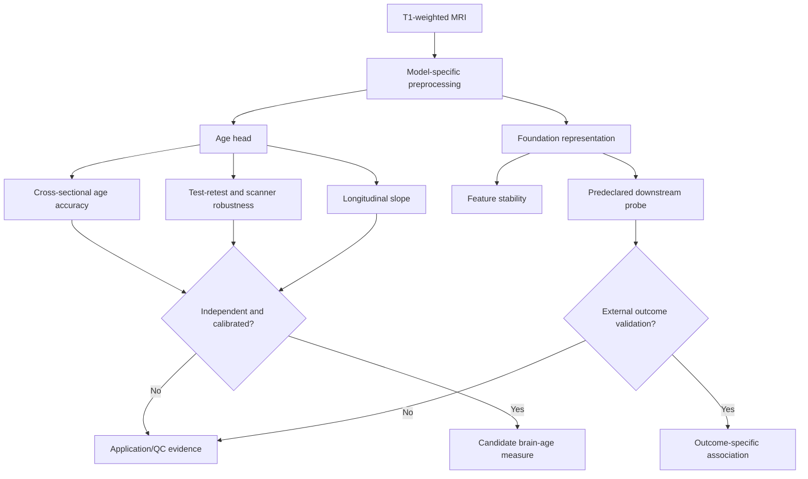

# BrainAge and NeuroFM evidence review

**Review type:** rapid scoping review with a reproducible search log, not a
systematic review or meta-analysis.

**Search date:** 2026-07-18. **Scope:** age prediction from structural MRI,
brain-age gap, longitudinal consistency, test-retest and scanner robustness,
model-specific preprocessing, and foundation-model representations.

## Research question

Which evaluation design can distinguish accurate chronological-age prediction,
technical robustness, longitudinal change, and health association in structural
MRI models?

This project uses **NeuroFM from `rockNroll87q/NeuroFM`**. It is not the
`peirong26/BrainFM` feature extractor. These repositories, weights, input
contracts, and claims are not interchangeable.

## Constructs that must remain separate

1. **Predicted chronological age** measures how well MRI features recover age
   labels in a specified population.
2. **Brain-age gap (BAG)** is predicted age minus chronological age, usually
   after a correction fitted without test leakage.
3. **Longitudinal brain-age change** is a within-person slope. It is not implied
   by a cross-sectional BAG.
4. **Technical robustness** measures sensitivity to repeat scanning, scanner,
   site, preprocessing, and controlled perturbations.
5. **Foundation features** are representations. Their stability does not prove
   age accuracy, segmentation accuracy, morphometric validity, or diagnosis.

## Search and selection

PubMed, DOI landing pages, official model repositories, medRxiv for explicitly
labelled current preprints, and official dataset pages were searched. Full
queries and selection rules are in [search_log.md](search_log.md). Priority was
given to external comparisons, longitudinal or repeated-measure studies, and
papers that examine bias or clinical utility rather than only internal MAE.

The review did not use duplicate screening, author contact, full-database export,
or meta-analysis. It maps evidence needed for the project and must not be
reported as exhaustive.

## Evidence map

| Evidence track | Representative evidence | What it supports | Main limitation |
|---|---|---|---|
| Brain-age concept | Cole and Franke 2017 | Individual age prediction is a useful research paradigm | Conceptual promise is not model-specific validation |
| BAG estimation | Smith et al. 2019, UK Biobank n=19,000 | Naive age residuals are biased; delta estimation affects associations | Correction can still fail under distribution shift |
| Cross-dataset workflow comparison | 128 workflows, total n=2,953 | MAE, generalization, retest, and longitudinal consistency select different models | No universal winner; behavior associations changed across datasets |
| Reliability across packages | Bacas et al. 2023, n=2,557 | Several packages had high repeat reliability | High ICC can coexist with offset, bias, or weak validity |
| Longitudinal interpretation | Vidal-Pineiro et al. 2021, two large longitudinal samples | Cross-sectional BAG was not associated with within-person change rate | Depends on features, ages, follow-up, and model family |
| Clinical utility comparison | Six public packages in ADNI, preregistered, published 2026 | Group differences exist, but prediction of future decline was weak | ADNI context; not every disease or model |
| Scanner/site effects | Fortin et al. 2018; travelling-subject studies | Acquisition effects can be large and require explicit modelling | Harmonization can remove biological signal or leak test information |
| NeuroFM | Dibble et al. 2026 medRxiv preprint and official code | Multi-head outputs and transferable latent representations are feasible | Preprint; synthetic 3T T1 training; population and domain limits |

## Findings

### 1. Low MAE is not sufficient evidence of biological ageing

SFCN reported MAE 2.14 years on UK Biobank and 2.90 years in the PAC 2019
challenge. DeepBrainNet reported external life-span MAE around 4.21 years. These
numbers establish age-prediction performance under their own datasets and
preprocessing. They are not directly rankable when age ranges, training overlap,
healthy definitions, scanners, and corrections differ.

Correlation is particularly insufficient: it can be high despite systematic
offset and slope error. Every evaluation therefore needs MAE, signed bias,
calibration intercept and slope, residual-age dependence, and uncertainty.

### 2. BAG is an analysis product, not a raw model fact

Regression toward the training mean commonly overestimates younger people and
underestimates older people. Smith et al. showed that how delta is estimated
changes downstream associations. Correction fitted to test labels is leakage.
Raw and corrected outputs should be retained, and the correction must be fitted
inside training folds or in a separate calibration cohort with adequate age
coverage.

Cross-sectional BAG may reflect early-life anatomy, stable constitutional
differences, past injury, current pathology, and measurement bias. Large
longitudinal analyses found little relation between cross-sectional BAG and the
rate of subsequent structural change. Calling BAG an individual's "rate of brain
ageing" is therefore unsupported without repeated scans.

### 3. Accuracy, repeatability, and utility can disagree

Comparative studies found high retest reliability for several packages, while
their offsets, image-quality sensitivity, and outcome associations differed.
The preregistered six-package ADNI comparison, published in 2026, found group differences but
only weak association with future disease onset, memory decline, or atrophy in
participants without neurodegenerative disease. A stable wrong or non-specific
quantity can have excellent ICC.

Model selection for this project must therefore be multi-objective: external age
calibration, same-person repeatability, cross-scanner agreement, longitudinal
consistency, and outcome-specific incremental information are separate gates.

### 4. Preprocessing is part of the model

There is no universal "BrainFM preprocessing." BrainageR uses SPM12 tissue
segmentation and spatial normalization; SynthBA provides its own skull stripping
and alignment; SFCN derivatives use their released training-space conventions.
Substituting raw, FreeSurfer-derived, skull-stripped, or resampled inputs can
change the target distribution and must be treated as a separate pipeline.

At local NeuroFM commit `d4e3c46`, the official input contract is skull-stripped
T1-weighted NIfTI. The code conforms to 1 mm isotropic, shape 256 x 256 x 256,
LIA orientation, cubic interpolation when resampling is required, and global
z-score normalization. The model documentation describes an age range of 40-90
years and training based on UK Biobank-derived synthetic 3T T1 volumes. Inputs
outside that range or domain are stress tests unless externally calibrated.

The NeuroFM README and output documentation have an ordering inconsistency in
their prose examples. The code and `docs/outputs.md` define
`[brain_age, sex, ventricle_volume, brain_volume]`. Project wrappers must use
named CSV columns or test the code-level schema, never assign labels by an
unverified positional comment.

### 5. Foundation features are an application branch

NeuroFM predictor mode produces age, sex, lateral ventricle volume, and total
brain volume. Encoder mode produces a fixed-dimensional representation. The
preprint reports downstream linear probes, but local feature extraction alone
only establishes that vectors were produced. Feature cosine similarity, ICC, or
clustering can evaluate technical stability. They cannot validate segmentation,
morphometry, disease risk, or a health profile without an independent reference
and leakage-controlled probe.

### 6. SIMON and SRPBS answer robustness questions

SIMON contains one male scanned 73 times across 36 scanners over more than 15
years. It is valuable for observing whether predictions increase with true age
and how scanner changes perturb one individual. It cannot estimate population
MAE, demographic calibration, or a general longitudinal slope. NeuroFM's stated
40-90 range also makes SIMON observations below 40 out of range.

The SRPBS travelling-subject resource contains repeated multi-site scans from
nine young men. It can estimate site/scanner variance while holding identity
approximately fixed. Its narrow age, sex, and sample composition preclude a
general age-accuracy claim. Neither dataset should be used for tuning and then
presented as blind validation.

## Implications for this project

The primary BrainAge claim should be:

> Under each model's official preprocessing, compare public brain-age heads on
> independent age-labelled data and quantify same-person variation on held-out
> test-retest and travelling-subject datasets. Evaluate longitudinal slope
> separately from cross-sectional BAG.

The `rockNroll87q/NeuroFM` branch should report predictor outputs and feature
stability. It remains a research/application branch until its age head is tested
on in-range external people and its volume outputs are compared with independent
morphometry. BrainFM feature outputs do not validate FreeSurfer/FastSurfer or any
other segmentation.

## Key references

1. Cole JH, Franke K. Predicting Age Using Neuroimaging: Innovative Brain Ageing
   Biomarkers. *Trends in Neurosciences*. 2017;40:681-690.
   [doi:10.1016/j.tins.2017.10.001](https://doi.org/10.1016/j.tins.2017.10.001).
2. Smith SM, et al. Estimation of brain age delta from brain imaging.
   *NeuroImage*. 2019;200:528-539.
   [doi:10.1016/j.neuroimage.2019.06.017](https://doi.org/10.1016/j.neuroimage.2019.06.017).
3. Peng H, et al. Accurate brain age prediction with lightweight deep neural
   networks. *Medical Image Analysis*. 2021;68:101871.
   [doi:10.1016/j.media.2020.101871](https://doi.org/10.1016/j.media.2020.101871).
4. Feng X, et al. Estimating brain age based on a uniform healthy population
   with deep learning and structural MRI. *Neurobiology of Aging*. 2020;91:15-25.
   [doi:10.1016/j.neurobiolaging.2020.02.009](https://doi.org/10.1016/j.neurobiolaging.2020.02.009).
5. More S, et al. Brain-age prediction: a systematic comparison of machine
   learning workflows. *NeuroImage*. 2023;270:119947.
   [doi:10.1016/j.neuroimage.2023.119947](https://doi.org/10.1016/j.neuroimage.2023.119947).
6. Bacas E, et al. Probing multiple algorithms to calculate brain age.
   *Human Brain Mapping*. 2023;44:3481-3492.
   [doi:10.1002/hbm.26292](https://doi.org/10.1002/hbm.26292).
7. Vidal-Pineiro D, et al. Individual variations in brain age relate to
   early-life factors more than to longitudinal brain change. *eLife*.
   2021;10:e69995.
   [doi:10.7554/eLife.69995](https://doi.org/10.7554/eLife.69995).
8. Franke K, Gaser C. Ten Years of BrainAGE as a Neuroimaging Biomarker.
   *Frontiers in Neurology*. 2019.
   [PubMed](https://pubmed.ncbi.nlm.nih.gov/31474922/).
9. Fortin JP, et al. Harmonization of cortical thickness measurements across
   scanners and sites. *NeuroImage*. 2018;167:104-120.
   [doi:10.1016/j.neuroimage.2017.11.024](https://doi.org/10.1016/j.neuroimage.2017.11.024).
10. Dibble A, et al. NeuroFM: Toward Precision Neuroimaging with Foundation
    Models for Individualized Brain Health Estimation. medRxiv preprint, 2026.
    [doi:10.64898/2026.03.27.26349489](https://doi.org/10.64898/2026.03.27.26349489).
11. Dorfel RP, et al. Prediction of brain age using structural MRI: a comparison
    of clinical utility of publicly available software packages. *EBioMedicine*.
    2026;123:106094.
    [doi:10.1016/j.ebiom.2025.106094](https://doi.org/10.1016/j.ebiom.2025.106094).
12. Duchesne S, et al. Structural and functional multi-platform MRI series of a
    single human volunteer over more than fifteen years. *Scientific Data*.
    2019;6:245.
    [doi:10.1038/s41597-019-0262-8](https://doi.org/10.1038/s41597-019-0262-8).
