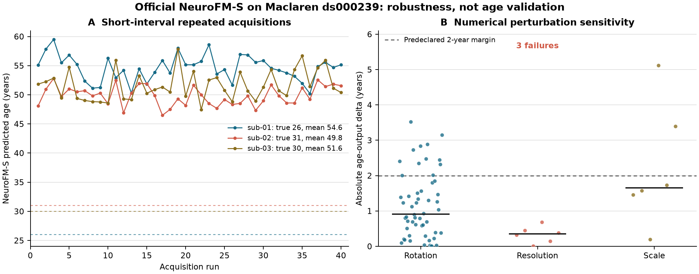

# NeuroFM-S Maclaren robustness results

**Analysis date:** 2026-07-19. **Claim level:** B0 execution and a limited B2
technical robustness characterization. This is not B1 age validation.

## Scope and provenance

The locked analysis used all 120 T1 acquisitions from three participants in
Maclaren `ds000239` (40 scans each), HD-BET 2.0.1 skull stripping, and the
official [`rockNroll87q/NeuroFM`](https://github.com/rockNroll87q/NeuroFM)
NeuroFM-S pipeline at commit
`d4e3c463910d939a681d24ebdeb26d44dea6878f`. The weight SHA-256 was
`8015a0552214b87e43b5462b6c183f8d0da2d957d7ae11ed09a2e3355f5e991f`.
The direct API-to-named-CSV schema gate passed with zero output difference.

All participants were aged 26-31 years, below NeuroFM's documented 40-90-year
range. Predicted-minus-chronological values are therefore descriptive
out-of-range outputs, not age errors suitable for MAE, calibration, brain-age
gap, or biological-age claims.

## Baseline results

Inference completed for all 120 inputs without per-volume outputs.

| Participant | Reported age | Mean predicted age | Within-person SD | Min-max |
|---|---:|---:|---:|---:|
| sub-01 | 26 | 54.59 | 2.19 | 50.19-59.50 |
| sub-02 | 31 | 49.85 | 1.67 | 46.48-52.81 |
| sub-03 | 30 | 51.62 | 2.55 | 47.45-57.82 |

The model overestimated all three out-of-range ages by approximately 19-29
years. The three participant means were not ordered by chronological age. With
only three people and no participant in the supported age range, neither fact
estimates population bias, slope, or accuracy.

| Output | Pooled within-subject SD | RC95 | Pairwise absolute difference p95 | ICC(2,1) |
|---|---:|---:|---:|---:|
| Brain age, years | 2.17 | 6.00 | 5.98 | 0.55 |
| Ventricle volume, mm3 | 2,707 | 7,502 | 7,571 | 0.85 |
| Brain volume, mm3 | 28,014 | 77,651 | 77,207 | 0.44 |

The predeclared age-output screen required a pairwise absolute-difference p95
no greater than five years. The observed 5.98 years failed that screen. The
session-bootstrap ICC lower bound was 0.44, also below the general 0.75 gate;
these intervals are conditional on the three participants and are not
population confidence intervals. Volume heads have no independent morphometry
reference here, so their repeatability does not establish volume accuracy.

The sex head predicted the male class in 39/40 scans for male sub-01 and 40/40
for male sub-02, but also in 40/40 scans for female sub-03. This is an audit
failure for one participant, not evidence about sex-related health.

## Representation stability

The released inference code produced a `120 x 160` latent array. Its registry
declares 161 dimensions, but at the locked commit NeuroFM-S has
`num_neck_layers=0` and the loaded `multihead_output` layer is 160-dimensional.
The upstream code and weights were not modified; both values are recorded.

| Feature diagnostic | Result |
|---|---:|
| Median per-dimension ICC(2,1) | 0.471 |
| Dimensions with ICC above 0.75 | 23.75% |
| Nearest-neighbour identity retention | 100% |
| Median within-person cosine distance | 0.0208 |
| Median between-person cosine distance | 0.0655 |
| Within-person distance p95 / between-person p05 | 0.0636 / 0.0290 |

Repeated scans retained identity locally, but per-feature agreement was mixed
and the distribution tails overlapped. These are representation-QC results;
they do not validate segmentation, morphometry, disease prediction, or any
downstream probe.

## Perturbation screen

The perturbation set was frozen before perturbed predictions were inspected and
used run 20 from each participant. Scale and rotation were applied in a fixed
voxel grid with cubic interpolation. Resolution variants were generated by
cubic resampling and then passed through the unchanged official NeuroFM
preprocessing.

| Family | Successful / attempted | Mean absolute age delta | Age-delta p95 | Maximum | Attempts within 2-year margin |
|---|---:|---:|---:|---:|---:|
| Rotation | 54 / 54 | 1.16 y | 2.85 y | 3.52 y | 77.8% |
| Resolution | 6 / 9 | 0.33 y among successes | 0.63 y | 0.69 y | 66.7% including failures |
| Scale | 6 / 6 | 2.25 y | 4.69 y | 5.12 y | 66.7% |

At scale 1.05, mean signed age shift was +3.42 years and the maximum was +5.12
years. Scaling is a numerical sensitivity test, not simulated biological brain
growth. Successful rotations changed ventricular-volume output by 6.7% on
average and as much as 28.0%; only 46.3% stayed within the predeclared 5%
engineering margin. Brain-volume changes were smaller, but accuracy remains
untested.

All three `resolution_1mm` inputs failed. Resampling preserved the field of view
as `236 x 270 x 270` at 1 mm RAS. NeuroFM's fast conform path attempted padding
and reorientation, could not crop axes larger than 256, and supplied an
incompatible shape to the model. The failures remain in the denominator. The
successful 0.8 and 1.2 mm variants do not cancel this geometry-dependent
preprocessing failure.

## Scientific conclusion

The official NeuroFM-S pipeline is executable on the locked HD-BET Maclaren
inputs, but the age head did not pass the predeclared repeatability screen and
was sensitive to small rotations and especially fixed-grid scale changes. The
resolution test also exposed an official conform failure for a valid 1 mm image
whose axes exceeded 256 voxels. The representation preserves participant
identity better than individual feature values, but remains technical QC.

No result here supports age accuracy, calibrated brain-age gap, biological
ageing rate, segmentation or morphometric validity, diagnosis, or clinical
utility. The next independent gate is an in-range external accuracy cohort;
the acquired BNU1 young-adult data can strengthen repeatability estimation but
cannot supply that age-validation gate for NeuroFM.

## Reproducible compact artifacts

- Protocol: [`maclaren_protocol.md`](maclaren_protocol.md)
- Baseline predictions: [`../../data/brainage/maclaren_neurofm_predictions.csv`](../../data/brainage/maclaren_neurofm_predictions.csv)
- Scalar repeatability: [`../../data/brainage/maclaren_repeatability_summary.csv`](../../data/brainage/maclaren_repeatability_summary.csv)
- Feature stability: [`../../data/brainage/maclaren_feature_stability_summary.csv`](../../data/brainage/maclaren_feature_stability_summary.csv)
- Perturbation results: [`../../data/brainage/maclaren_perturbation_summary.csv`](../../data/brainage/maclaren_perturbation_summary.csv)
- Metadata: [`../../data/brainage/maclaren_neurofm_metadata.json`](../../data/brainage/maclaren_neurofm_metadata.json) and [`../../data/brainage/maclaren_perturbation_metadata.json`](../../data/brainage/maclaren_perturbation_metadata.json)

Raw MRI, skull-stripped volumes, masks, perturbed NIfTI files, model weights,
aggregate latent arrays, and logs remain outside Git.
