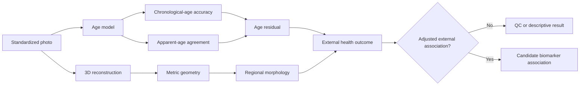

# FaceAge evidence review

**Review type:** rapid scoping review with a reproducible search log, not a
systematic review or meta-analysis.

**Search date:** 2026-07-18. **Coverage:** human facial photographs, 3D facial
surface reconstruction, facial morphometry, age estimation, and associations
between facial age and health outcomes. The review does not evaluate diagnostic
prediction of specific diseases from a face.

## Research question

Which facial measurements can support reproducible age-related research, and
which claims are justified by current evidence?

The project separates four targets that are often conflated:

1. **Chronological-age prediction:** estimate years since birth from an image.
2. **Apparent age:** estimate how old a person looks to human observers.
3. **Facial morphology:** estimate metric or scale-free shape, independent of
   texture, expression, pose, and camera.
4. **Health association:** test whether a pre-specified facial measure adds
   information about a health outcome after chronological age and confounders.

An accurate chronological-age model is not automatically a biological-age
model. A plausible 3D avatar is not automatically a metric reconstruction. A
health association is not a diagnosis and does not establish a causal pathway.

## Search and selection

The search used PubMed, Crossref/DOI landing pages, CVF/ECVA proceedings, and
official model or dataset pages. Search strings and selection rules are in
[search_log.md](search_log.md). Priority was given to peer-reviewed primary
studies, externally evaluated models, longitudinal or repeated-measure studies,
and official benchmark specifications. Preprints were retained only to identify
current methods or unresolved claims and are labelled as such.

Included records had to report at least one of: age-prediction performance,
health-outcome association adjusted for chronological age, repeatability,
longitudinal facial change, or 3D reconstruction error against a scan. Studies
that inferred a disease, personality, or social trait without an appropriate
outcome and external validation were excluded from the evidence base.

This rapid review did not perform duplicate screening, full-database export,
formal meta-analysis, or author contact. It should therefore be used to design
experiments, not to claim exhaustive coverage.

## Evidence map

| Evidence track | Representative evidence | What it supports | Main limitation |
|---|---|---|---|
| Apparent age and survival | Christensen et al. studied 1,826 twins aged 70+; perceived age was associated with survival after adjustment | Apparent age may carry health information in older adults | Human ratings, older Danish cohort, observational association |
| Deep facial age and cancer prognosis | Bontempi et al. trained FaceAge on 58,851 presumed healthy people aged 60+ and evaluated 6,196 cancer patients | A learned facial-age score can add prognostic information in specific cancer cohorts | Restricted training age, disease context, residual confounding, not a universal ageing clock |
| Image age estimation | DEX and later systems predict chronological or apparent age from cropped photographs | Feasibility and benchmark accuracy | Web-label noise, demographic imbalance, identity leakage, domain shift |
| 3D reconstruction | DECA reconstructs animatable detail; MICA targets metrical shape; NoW defines scan-to-mesh evaluation | A framework for image-to-surface evaluation | Single-view scale ambiguity; plausible geometry can be metrically wrong |
| Longitudinal 3D morphology | Imaizumi et al. measured 171 men twice about 10 years apart | Adult facial shape changes can be measured longitudinally | One sex and population; not a photo model benchmark |
| Cross-sectional 3D ageing | Windhager et al. modelled 88 adults aged 26-90; FaceBase and Headspace provide larger cross-sectional resources | Candidate regions and demographic covariates | Cross-sectional age differences are not within-person ageing rates |
| Face as general health biomarker | Obrochta et al. screened 702 records and included 21 | Existing symmetry/dimorphism-health evidence is mixed | Heterogeneous exposures and outcomes; no universal face-health score |

## Findings

### 1. Apparent age has outcome associations, but the construct is contextual

The Danish twin study provides comparatively strong observational evidence that
human-rated perceived age contains information beyond chronological age in an
older cohort. The within-twin design reduces some familial confounding, but it
does not identify which facial component is causal or transport the association
to younger populations, cameras, or automated models.

FaceAge extends the idea to a deep model and reports adjusted survival
associations in cancer cohorts. This is evidence for prognostic association in
those settings. It is not evidence that its output measures a single latent
biological age, that it is calibrated in healthy adults below 60, or that it can
diagnose cancer. The primary publication DOI is
`10.1016/j.landig.2025.03.002`; the similar-looking article identifier must not
be substituted for the DOI.

### 2. Chronological-age accuracy and biological validity can diverge

Age-estimation benchmarks reward prediction of chronological labels. A model
can obtain low MAE by exploiting cohort, capture, styling, or demographic cues.
Regression to the training-set mean can also make residuals age-dependent.
Consequently, MAE and correlation are necessary model diagnostics but do not
validate an age residual as a health measure. Biological interpretation requires
an independently measured outcome, pre-specified covariates, calibration fitted
without test-set leakage, and external replication.

The 2025 systematic review of machine learning for skin age found reported MAE
values spanning approximately 2.30 to 8.16 years and frequent high PROBAST risk
of bias, especially from small samples. Those values are not directly comparable
across age ranges, labels, image protocols, and split strategies.

### 3. Reconstructed 3D faces require metric validation

DECA is designed for detailed, animatable reconstruction from in-the-wild
images. MICA explicitly addresses metric facial shape. The NoW benchmark aligns
predictions to scans and evaluates scan-to-mesh distance, with separate metric
and scale-invariant settings. This distinction is central for this project:
similar-looking renders or stable FLAME coefficients do not prove millimetre
accuracy.

For MRI-derived facial surfaces, a photo reconstruction should be compared with
the same participant's non-defaced MRI surface only after the coordinate,
cropping, rigid/similarity alignment, and valid facial-region mask are fixed.
MRI is not an ideal optical skin-surface ground truth, so scanner resolution,
partial-volume effects, head support, facial expression, and acquisition dates
remain measurement error sources.

### 4. Facial ageing is regional and confounded

Longitudinal 3D studies support measurable within-person changes, but available
samples are much smaller and less diverse than web-photo age datasets.
Cross-sectional studies suggest changes in soft tissue and skeletal shape, and
possible effect modification by sex, BMI, ancestry, and menopause. These are
hypothesis-generating regions and moderators, not universal directions that can
be assigned to an individual from one image.

Expression, camera distance, focal length, pose, lighting, makeup, facial hair,
hydration, acute illness, body mass, dental state, and cosmetic intervention can
all alter facial measurements or model outputs. They should be controlled or
recorded, not silently interpreted as ageing.

## Quality assessment

The most credible evidence in this scope comes from large externally evaluated
cohorts, repeated measurements, or a physical 3D reference. Major recurring
risks are participant selection, noisy age labels, identity leakage across
splits, inadequate calibration, selective reporting, restricted demographic
coverage, and outcome models that omit chronological age or site/camera effects.

Prediction studies intended to support health claims should be assessed with
PROBAST+AI. Model development and model evaluation must remain separate. A
single-person series can assess pipeline repeatability and failure modes but has
no population-level calibration or clinical validity.

## Implications for this project

The first FaceAge paper should target a measurable engineering and scientific
claim:

> Under a standardized acquisition protocol, separately evaluated photo-age
> and 3D facial-shape pipelines produce repeatable outputs, and MRI-derived
> facial surfaces can quantify their geometry error in participants for whom a
> non-defaced T1 image is available.

Only after that gate should the project test whether a facial-age residual or a
pre-specified regional morphology score associates with external health or
brain measures. Kate n=1 is a development case. It cannot estimate accuracy,
population prevalence, subgroup performance, or clinical utility.

## Key references

1. Christensen K, et al. Perceived age as clinically useful biomarker of ageing:
   cohort study. *BMJ*. 2009;339:b5262.
   [doi:10.1136/bmj.b5262](https://doi.org/10.1136/bmj.b5262).
2. Bontempi D, et al. FaceAge, a deep learning system to estimate biological age
   from face photographs to improve prognostication. *Lancet Digital Health*.
   2025;7:100870.
   [doi:10.1016/j.landig.2025.03.002](https://doi.org/10.1016/j.landig.2025.03.002).
3. Rothe R, Timofte R, Van Gool L. DEX: Deep EXpectation of Apparent Age From a
   Single Image. ICCV Workshops 2015.
   [CVF paper](https://openaccess.thecvf.com/content_iccv_2015_workshops/w11/html/Rothe_DEX_Deep_EXpectation_ICCV_2015_paper.html).
4. Feng Y, et al. Learning an Animatable Detailed 3D Face Model from In-the-Wild
   Images. *ACM Transactions on Graphics*. 2021.
   [official DECA page](https://deca.is.tue.mpg.de/).
5. Zielonka W, Bolkart T, Thies J. Towards Metrical Reconstruction of Human
   Faces. ECCV 2022.
   [ECVA paper](https://www.ecva.net/papers/eccv_2022/papers_ECCV/papers/136730249.pdf).
6. Sanyal S, et al. Learning to Regress 3D Face Shape and Expression from an
   Image without 3D Supervision. CVPR 2019.
   [official NoW benchmark](https://now.is.tue.mpg.de/).
7. Imaizumi K, et al. Three-dimensional analyses of aging-induced alterations in
   facial shape. *International Journal of Legal Medicine*. 2015;129:385-393.
   [doi:10.1007/s00414-014-1114-x](https://doi.org/10.1007/s00414-014-1114-x).
8. Windhager S, et al. Facial aging trajectories: a common shape pattern in male
   and female faces is disrupted after menopause. *American Journal of Physical
   Anthropology*. 2019;169:678-688.
   [doi:10.1002/ajpa.23878](https://doi.org/10.1002/ajpa.23878).
9. Obrochta WM, et al. Is the human face a biomarker of health? A scoping
   review. *PLOS ONE*. 2025;20:e0318138.
   [doi:10.1371/journal.pone.0318138](https://doi.org/10.1371/journal.pone.0318138).
10. McMullen E, et al. Machine learning methods for determining skin age: a
    systematic review. 2025.
    [doi:10.1016/j.jtv.2025.100887](https://doi.org/10.1016/j.jtv.2025.100887).
11. Moons KGM, et al. PROBAST+AI. *BMJ*. 2025;388:e082505.
    [doi:10.1136/bmj-2024-082505](https://doi.org/10.1136/bmj-2024-082505).
