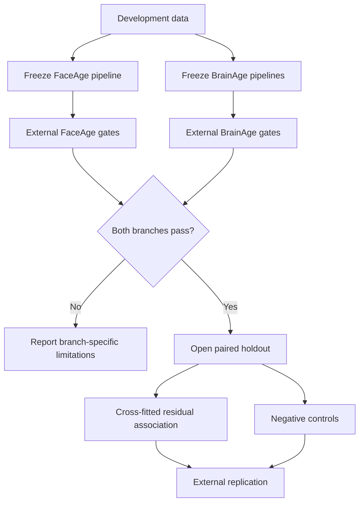

# FaceAge to BrainAge research program

**Protocol status:** research specification, version 1.0, 2026-07-18.

**Intended use:** methodological research. This protocol does not define a
clinical, diagnostic, or consumer health score.

## Objective

Develop and independently validate two measurement branches, facial age and
brain age, then test whether their age-adjusted residual information is related
in people measured with both modalities.

The target is not one authoritative biological-age number. The target is a
profile with explicit measurement properties:

- facial chronological/apparent age and regional facial morphology;
- structural MRI age and model-specific morphometric outputs;
- test-retest, scanner, preprocessing, and perturbation uncertainty;
- outcome-specific extensions only when the required modality and reference
  labels exist.

## Primary aims

### Aim 1: FaceAge measurement

Evaluate photo-age prediction and 3D facial reconstruction as separate tasks.

**H1a:** an age model evaluated on independent participants has better
chronological/apparent-age accuracy than a development-set mean baseline and is
calibrated across the declared adult age range.

**H1b:** repeated standardized photographs produce age and geometry outputs
within the frozen repeatability margins in
[the FaceAge metric contract](faceage/metrics_protocol.md).

**H1c:** when a same-person 3D scan or non-defaced MRI face surface exists,
metric reconstruction error can be quantified under a predeclared rigid
alignment and facial mask.

### Aim 2: BrainAge measurement

Compare complete public brain-age pipelines under their official preprocessing.

**H2a:** at least one pipeline is calibrated and more accurate than the
train-mean baseline in a locked, in-range external cohort.

**H2b:** the selected pipeline meets predeclared repeatability and scanner/site
margins on held-out test-retest and travelling-subject data.

**H2c:** longitudinal slope is evaluated independently from cross-sectional
brain-age gap. A slope near one is consistency, not by itself biological-age
validity.

NeuroFM in this project means `rockNroll87q/NeuroFM`. Predictor outputs and
embeddings form an application and robustness branch. Feature extraction does
not validate segmentation or morphometry.

### Aim 3: Paired FaceAge-BrainAge association

After Aims 1 and 2 are frozen, test whether facial and brain measurements share
age-independent information in an unseen paired cohort.

**Primary H3:** cross-fitted FaceAge and BrainAge residuals have a positive
association after predeclared participant and acquisition covariates.

This is an association hypothesis. It does not imply that either residual is a
causal ageing rate or that one modality diagnoses the other.

## Evidence stages

| Stage | Data | Decision gate | Maximum claim |
|---|---|---|---|
| 0 provenance | Kate n=1 and local examples | Reproducible input, model, checkpoint, and QC | Pipeline execution |
| 1 independent accuracy | Unseen age-labelled participants | Accuracy, calibration, failure, subgroup metrics | Age prediction in the tested cohort |
| 2 robustness | Held-out repeats and travelling subjects | Agreement, variance components, equivalence margins | Robustness under tested conditions |
| 3 longitudinal | Repeated participants over time | Mixed-model slope and change error | Longitudinal consistency |
| 4 paired association | Unseen people with both branches | Adjusted association plus negative controls | Cross-modal association |
| 5 outcome extension | External phenotype and replication | Incremental value over clinical baseline | Outcome-specific association |

Kate n=1, SIMON n=1, and SRPBS travelling subjects remain development or
robustness resources. They do not establish population accuracy, prevalence,
diagnosis, or clinical utility.

## Current execution status

| Branch/gate | Current evidence | Status |
|---|---|---|
| FaceAge independent accuracy and metric geometry | Protocols and literature review are frozen; current Case A and SIMON outputs remain development/QC | Not yet tested on a locked external cohort |
| BrainAge test-retest robustness | Official NeuroFM-S completed on 120 Maclaren scans after HD-BET; pairwise age-difference p95 was 5.98 years against a 5-year screen | Failed the predeclared screen; out-of-range robustness only |
| BrainAge perturbation robustness | 66/69 locked perturbations succeeded; all three valid 1 mm geometries failed the official conform path | Geometry-dependent preprocessing failure retained in denominator |
| BNU1 repeatability cohort | 107 T1 scans acquired and verified; 49 QC-passed pairs frozen | Ready for model-specific preprocessing; not an age-accuracy cohort |
| BrainAge independent accuracy | No unseen, in-range cohort has completed the locked comparison | Blocking any calibration or biological-age claim |
| Paired FaceAge-BrainAge association | Branch-specific external gates are incomplete | Holdout remains closed |

This table reports the highest evidence stage reached, not a model ranking.
The detailed Maclaren result and its limitations are in
[the robustness report](brainage/maclaren_results.md).

## Confirmatory paired analysis

### Population and split

The preferred confirmatory cohort contains 480 adults aged 20-79, with 40
participants per sex in each 10-year age band. A locked 30% participant-level
holdout is never used for pipeline selection or calibration. A repeatability
subset of at least 60 participants receives a second standardized photo session
and MRI within 7-14 days when feasible.

The target of 480 is conservative rather than a formal final power result. A
simple two-sided correlation of 0.20 at alpha 0.05 and 80% power requires about
194 independent participants using the Fisher-z approximation. Covariates,
cross-fitting, age strata, measurement attenuation, subgroup reporting, and an
independent holdout motivate the larger target. The final analysis-specific
simulation must be run before recruitment is closed.

### Preprocessing and outputs

- Face and brain pipelines are frozen before opening the paired holdout.
- All repeated observations from a participant remain in one split.
- Model-specific preprocessing is used; no shared convenience preprocessing is
  substituted after results are seen.
- Raw and calibrated predictions are retained.
- QC failures remain in the participant flow and failure analysis.

### Primary endpoint

Within development folds, fit separate calibration models for face and brain
predictions as functions of chronological age and predeclared acquisition
covariates. Apply those models out of fold to obtain residuals. In the locked
holdout, estimate the association between facial and brain residuals with age
modelled flexibly and with sex, site/scanner, TIV/head size, BMI, and branch QC
scores as predeclared covariates.

Report the partial correlation and standardized regression coefficient with 95%
confidence intervals. The primary result is successful only if its interval
excludes zero in the predeclared direction and the effect replicates in a second
cohort. Statistical significance without calibration, negative controls, or
replication is hypothesis-generating.

### Negative controls and sensitivity analyses

1. Randomly mismatch face and brain records within age, sex, and site strata.
   The observed association must exceed the permutation distribution.
2. Report raw age-gap correlation to demonstrate the shared-age artefact, but do
   not use it as the primary endpoint.
3. Refit after excluding severe QC failures, major weight change, and time gaps
   beyond the predeclared paired-acquisition window.
4. Quantify site predictability from each representation. Strong site signal is
   a confounding warning, not a useful biological feature.
5. Repeat with rigid metric and similarity-aligned facial features kept separate.
6. Test whether results survive alternate age splines and cross-fitting seeds.

## Model comparison policy

The FaceAge and BrainAge branches keep their own primary metrics. Models are not
ranked by a single composite score. Report Pareto trade-offs among age accuracy,
calibration, repeatability, scanner/site variance, failure rate, runtime, and
coverage.

Bias correction, harmonization, feature selection, region selection, and
downstream probing occur inside training folds. Dataset component overlap with
model pretraining is recorded before any dataset is called external.

## Extensions beyond structural age

The broader feature palette is organized by measurable reference, not by what a
T1 MRI might appear to suggest.

| Profile | Required measurement | Example endpoint | T1-only status |
|---|---|---|---|
| Structural age | T1 MRI | calibrated brain age, regional morphometry | Core |
| Vascular burden | FLAIR, SWI/T2*, TOF-MRA, blood pressure, lipids | WMH, microbleed, vessel and risk-factor measures | Not validated by T1 alone |
| White-matter microstructure | DWI | FA/MD and tract-specific measures | Not available from T1 alone |
| Neurodegeneration | cognition, diagnosis, longitudinal MRI, optional PET/CSF | cognitive decline, atrophy, biomarker status | Requires external outcomes |
| Stress, pain, loneliness, mobility | validated questionnaires, wearables, GPS/environment | predeclared behavioural or exposure scores | Cannot be inferred from anatomy alone |
| Dental, sinus, retina, skin | dedicated dental/ENT/ophthalmic/dermatologic reference | modality-specific measurements | Incidental T1 appearance is not a validated endpoint |

These modules may be added as independent outcome studies. They are not extra
labels mined from the same structural scan. Sex is treated as a moderator and
fairness/audit variable, never as a health score.

## Success criteria

The research program is complete only when:

1. Both branch reviews and search logs are versioned and updated for the final
   search date.
2. The FaceAge and BrainAge pipelines pass or transparently fail their locked
   external metric contracts.
3. Model, checkpoint, preprocessing, input, QC, exclusion, and dataset-overlap
   provenance is complete.
4. The paired primary endpoint and negative controls are run on a holdout not
   used for tuning.
5. At least one independent paired cohort replicates the primary direction and
   reports the effect interval.
6. Claims are limited to the highest evidence stage actually achieved.

## Reporting and governance

Follow TRIPOD+AI/PROBAST+AI principles for prediction studies and report all
attempted cases. Preregister the primary endpoint, exclusions, equivalence
margins, covariates, and multiplicity families before opening the holdout.

Faces and non-defaced head MRI are highly identifying biometric data. Raw data,
linkage keys, NIfTI files, photographs, model weights, and logs stay in approved
controlled storage. Git contains code, de-identified aggregate results, schemas,
and small reproducibility metadata only.
