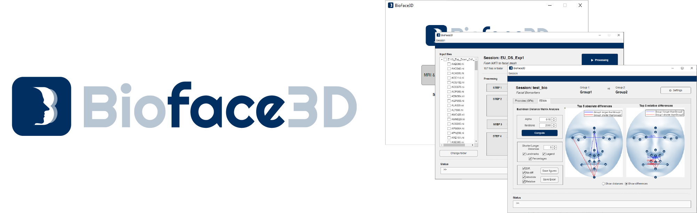
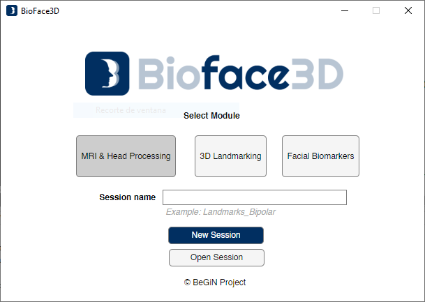
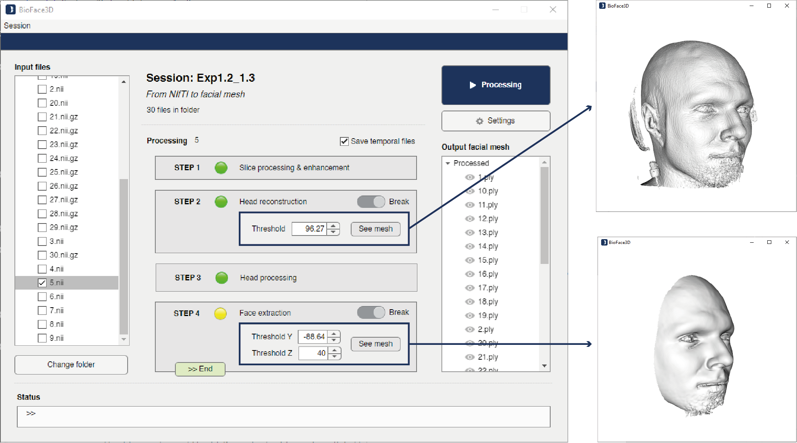
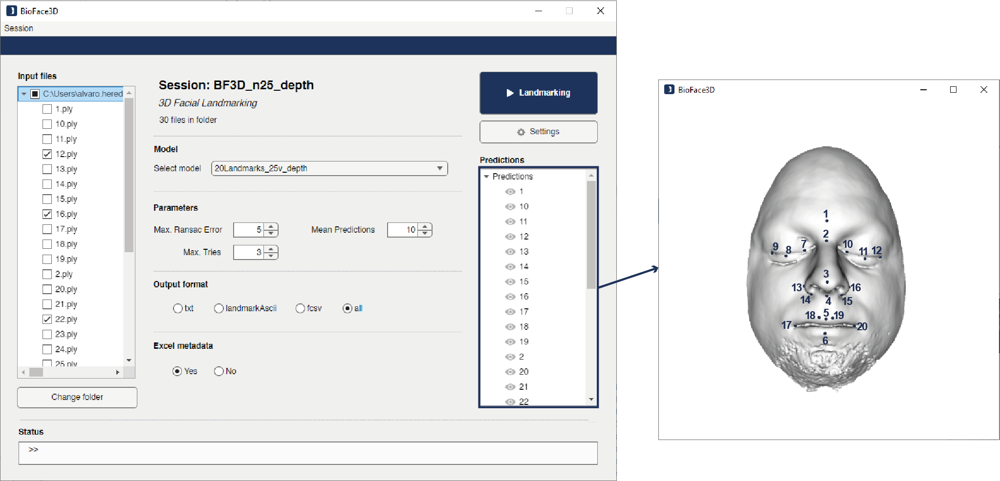
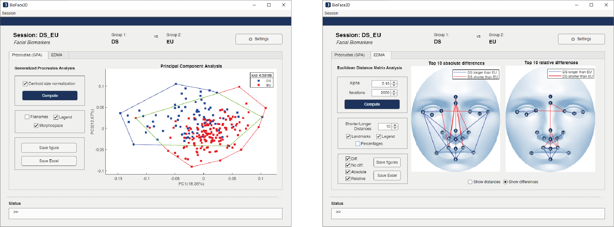

# BioFace3D

**BioFace3D: An end-to-end open-source software for automated extraction of potential 3D facial biomarkers from MRI scans**



---

## Citing BioFace3D

If you use BioFace3D in your research, please cite the
[paper](file:///C:/Users/alvaro.heredia/Zotero/storage/BAAMVKHF/S0169260725004274.html).

```
 @article{Heredia-Lidón2025, 
 title={BioFace3D: An end-to-end open-source software for automated extraction of potential 3D facial biomarkers from MRI scans}, volume={271}, ISSN={0169-2607}, DOI={10.1016/j.cmpb.2025.109010},
 journal={Computer Methods and Programs in Biomedicine},
 author={Heredia-Lidón, Álvaro and Echeverry-Quiceno, Luis M. and González, Alejandro and Hostalet, Noemí and Pomarol-Clotet, Edith and Fortea, Juan and Fatjó-Vilas, Mar and Martínez-Abadías, Neus and Sevillano, Xavier},
 year={2025}, month=nov, pages={109010} }
```
---

## Updates

- 20-11-2024 : Initial commit

---

## Installation

### Requriements

The code has been tested in Windows 10 and Ubuntu 20.04 with GPU enabled and without a GPU (works but slow). It has been tested with the following dependencies:

- python==3.7
- absl-py==0.10.0
- imageio==2.13.1
- matplotlib==3.5.0
- torch==1.10.0
- scipy==1.7.1
- scikit-image==0.17.2
- scikit-learn==1.0.2
- tensorboard==2.7.0
- torchvision==0.11.1
- vtk==9.0.1.
- open3d==0.15.1
- openpyxl==3.1.2
- setuptools==59.5.0
- protobuf==3.19.4
- pymeshlab==2022.2.post4
- SimpleITK==2.0.0
- joblib==1.3.2
- nibabel==4.0.2
- pandas==1.1.5
- numpy==1.21.6
- scipy==1.7.1

### Prerequisites
Ensure you have MATLAB 2023b installed with the following toolboxes: Deep Learning, Statistics and Machine Learning, Image Processing, Computer Vision, and Mapping Toolbox. This tool has been developed and tested with MATLAB 2023b. Earlier versions may result in loss of functionality.

### Installation Steps

1. **Download Repository**: 
- Clone or [download](https://bitbucket.org/alvaro_heredia/bioface3d/src/main/) the repository from Bitbucket.

2. **Install Python**:
- If not already installed, download and install Python. The code has been tested with version 3.8. You can download Python 3.8 from [here](https://www.python.org/downloads/release/python-3810/).
- Ensure to select the option "Add Python to PATH" before clicking "Install Now".

3. **Verify Python Installation**:
   - Open the command prompt (Windows + R, type "cmd", then press Enter).
   - Type ```python --version``` and press Enter. You should see the installed Python version.

4. **Install virtualenv**: 
   - In the command prompt, type ```pip install virtualenv``` and press Enter. This will install the virtualenv tool, which allows you to create virtual environments.

5. **Create a Virtual Environment**:
   - Navigate to the directory where you want to create your virtual environment in the command prompt.
   - Once there, type ```python -m venv environment_name``` and press Enter. Replace "environment_name" with your desired name for the virtual environment.

6. **Update Configuration File**: 
   - Navigate to the downloaded repository folder and update the '_config.json' file with the paths.
   - The installation path should indicate the absolute path where the BioFace3D.mlapp executable file is located.
   - The VirtualEnv path should indicate the absolute path where the virtual environment has been created ("path_to_venv//environment_name//Scripts//python"). 
   - For sanity checks, add double line separators in the paths.

7. **Install Python Libraries**: 
   - Activate the virtual environment by navigating to the 'Scripts' directory within the virtual environment directory and typing `activate` in the command prompt.
   - Then, come back to the download repository folder and execute ``` pip install -r requirements.txt``` to install the required Python libraries.

8. **Open and Run BioFace3D.mlapp**:
   - Open the BioFace3D.mlapp file and execute it within MATLAB.

For any issues or inquiries, please refer to the documentation or contact the developer team.

---

## Getting started
To run the program from MATLAB, ensure that the MATLAB Current Folder corresponds to the folder where the BioFace3D.mlapp file is located. Once inside the folder, type the name of the program from the MATLAB Command Window:
```
>> BioFace3D
```
Once started, the module selection window will open. From there, you can open an existing Session or create a new Session.



To open a new Session, the JSON file corresponding to the Session configuration must be selected. In the case of creating a new Session, select a module and a Session name.


## Module 1: Face extraction from MRI

This module automatically produces a facial mesh from an MRI scan, taking as its input NIfTI file(s) (.nii/.nii.gz) and generating 3D facial meshes encoded in PLY file(s) (.ply) as output. It can process files individually or in batch mode.



The operation of the module is detailed below:

- Selection of the files to be processed in the left-hand column.
- Configuration of the parameters in the central part. The processes of 3D head model reconstruction and facial model extraction can be stopped to manually adjust reconstruction parameters and preview them.
- All other parameters can be configured from the Settings button.
- To start the automatic process, press the Run button.
- In the right-hand column you can preview the result of the facial extraction.


## Module 2: 3D landmarking

The 3D landmarking module takes as input data the 3D facial meshes in PLY (.ply) format from the previous module and generates output data file(s) in various formats with the automatically predicted facial 3D landmarks coordinates.

This model is based on the [MVCNN](https://github.com/RasmusRPaulsen/Deep-MVLM) landamrking model.



The operation of the module is detailed below:

- Selection of the files to be processed in the left-hand column.
- Selection of the landmarking model to be used, as well as the format of the output files.
- To start the automatic process, press the Run button.
- In the right-hand column you can preview the landmarking results.


## Module 3: Facial biomarkers

This last module allows the statistical comparison between two groups of individuals (i.e. patients and healthy subjects) through the automatic discovery of potential biomarkers. These biomarkers, obtained from their homologous landmarks by GM, characterize the diversity of faces in vectors that encode their morphology.



The operation of the module is detailed below:

- Select one spreadsheet for each study group. This spreadsheet containing the individuals' landmarks can be generated automatically from the GUI.
- Within the module, the biomarkers GPA and EDMA can be studied.
- For GPA biomarkers, it is possible to display the Convex hull of the morphospace.
- For EDMA biomarkers, it is possible to calculate all significant inter-group distances as well as top-N shorter/loonger characteristic distances.
- For each biomarker, it is possible to export figures and spreadsheets of the analysis.

---

## Getting started

The following are general instructions for the use of each module.

## Module 1

1. Open BioFace3D or run the command `>> BioFace3D` from the MATLAB Command Window.
2. In the BioFace3D Session window, either open an existing session or create a new one.
   - To open an existing session: Click on the **Open session** button and locate the session's JSON file.
   - To create a new session: Select the `MRI & Head Processing` module and enter a session name. Then, click **New session**.
   - If starting a new session, specify the input and output folder paths in the **Paths** window. These directories should contain the NIfTI files and the output folder, respectively. You can select the paths by clicking the folder button.
3. Once the **Module 1** interface is open, the left panel should display the NIfTI files available for processing. Select the desired files.
4. In the central section of the UI, you can:
   - Choose whether to save all temporary files generated during processing.
   - Enable pauses at Step 2 and Step 4 to preview intermediate results.
5. To modify module settings, click the **Settings** button. The following parameters can be configured:
   - **Session name**: Change the session name.
   - **Input / output path**: Modify the input and output directory paths.
   - **Batch alignment**: Enable fine alignment of facial structures (note that this increases processing time).
   - **Save snapshot**: Save a resulting image from the reconstruction.
   - **Smooth remesh**: Apply a smoothing filter to the facial surface.
6. To start the process, click the **Processing** button.
7. To stop the process, click the **Stop** button.
8. Once the process is complete, results can be previewed in the right column of the UI by double-clicking on each data item.

To check the module's status and any potential errors, please refer to the **Status bar** in the UI and the MATLAB Command Window.

## Module 2

1. Open BioFace3D or run the command `>> BioFace3D` from the MATLAB Command Window.
2. In the BioFace3D Session window, either open an existing session or create a new one.
   - To open an existing session: Click on the **Open session** button and locate the session's JSON file.
   - To create a new session: Select the `3D Landmarking` module and enter a session name. Then, click **New session**.
   - If starting a new session, specify the input and output folder paths in the **Paths** window. These directories should contain the 3D facial models and the output folder, respectively. You can select the paths by clicking the folder button.
3. Once the **Module 2** UI is open, the left panel should display the 3D facial model files available for landmarking. Select the desired files.
4. In the central section of the UI, you can:
   - Choose the landmarking model and number of landmarks.
   - Change MVCNN hyperparameters and output options. An Excel file can be generated with all the landmarks for **Module 3**.
5. To modify module settings, click the **Settings** button. The following parameters can be configured:
   - **Session name**: Change the session name.
   - **Input / output path**: Modify the input and output directory paths.
6. To start the process, click the **Landmarking** button.
7. To stop the process, click the **Stop** button.
8. Once the process is complete, results can be previewed in the right column of the UI by double-clicking on each data item.

## Module 3

1. Open BioFace3D or run the command `>> BioFace3D` from the MATLAB Command Window.
2. In the BioFace3D Session window, either open an existing session or create a new one.
   - To open an existing session: Click on the **Open session** button and locate the session's JSON file.
   - To create a new session: Select the `Facial Biomarkers` module and enter a session name. Then, click **New session**.
   - If starting a new session, specify the output path, the number of landmarks model, the name of the groups, and the paths for the Excel spreadsheets of each group in the **Paths** window (Figure B). You can select the Excel files by clicking the folder button.
3. Once the **Module 3** UI opens, it is divided into two sections: **GPA** and **EDMA** .
4. For a **GPA biomarkers analysis**:
   - Click on the **Compute** button. The morphospace will be displayed in the figure.
   - From the UI, file names, convex hulls, and captions can be displayed.
   - As a result of the module, you can export the figure or an Excel file with the calculation of all principal components and Procrustes landmarks.
5. For an **EDMA analysis**:
   - Select the number of iterations and the parameter `α` from the UI and click **Compute**.
   - Once the analysis is completed, the figures will show the significant distances between groups, accompanied by the percentage.
   - To display figures with significant top-distance, increase the number of short/long distances (n) from the interface. This will show the top-n relative and absolute distances between groups.
   - As a result of the module, all figures can be exported, along with an Excel file containing all significant inter-landmark distances.
6. To modify module settings, click the **Settings** button. The following parameters can be configured:
   - **Session name**: Change the session name.
   - **Input / output path**: Modify the input and output Excel file paths.

---

## Acknowledgements
The research in this paper was supported by the Joan Oró grant (2024 FI-3 00160) from the Recerca i Universitats Departament (DRU) of the Generalitat de Catalunya with grant 2023 FI-2 00160 and the European Social Fund, by Agencia Española de Investigación (PID2020-113609RB-C21/AEI/10.13039/501100011033), by Instituto de Salud Carlos III (ISCIII) through the contracts FI21/00093 and CP20/00072 (co-funded by European Regional Development Fund (ERDF)/European Social Fund “Investing in your future”) and by Fondation Jerome Lejeune with grant 2020b cycle-Project No.2001. The authors would also like to thank the Agència de Gestió d’Ajuts Universitaris i de Recerca (AGAUR) of the Generalitat de Catalunya (2021 SGR01396, 2021 SGR00706, 2021 SGR1475).

---

## Credits
This project uses [MVCNN](https://github.com/RasmusRPaulsen/Deep-MVLM) landamrking model of [Ramus R. Paulsen](https://people.compute.dtu.dk/rapa/)

---

## MIT License
 
Copyright (c) 2026 Computer Vision Group, La Salle - Universitat Ramon Llull
 
Permission is hereby granted, free of charge, to any person obtaining a copy
of this software and associated documentation files (the "Software"), to deal
in the Software without restriction, including without limitation the rights
to use, copy, modify, merge, publish, distribute, sublicense, and/or sell
copies of the Software, and to permit persons to whom the Software is
furnished to do so, subject to the following conditions:
 
The above copyright notice and this permission notice shall be included in all
copies or substantial portions of the Software.
 
THE SOFTWARE IS PROVIDED "AS IS", WITHOUT WARRANTY OF ANY KIND, EXPRESS OR
IMPLIED, INCLUDING BUT NOT LIMITED TO THE WARRANTIES OF MERCHANTABILITY,
FITNESS FOR A PARTICULAR PURPOSE AND NONINFRINGEMENT. IN NO EVENT SHALL THE
AUTHORS OR COPYRIGHT HOLDERS BE LIABLE FOR ANY CLAIM, DAMAGES OR OTHER
LIABILITY, WHETHER IN AN ACTION OF CONTRACT, TORT OR OTHERWISE, ARISING FROM,
OUT OF OR IN CONNECTION WITH THE SOFTWARE OR THE USE OR OTHER DEALINGS IN THE
SOFTWARE.
